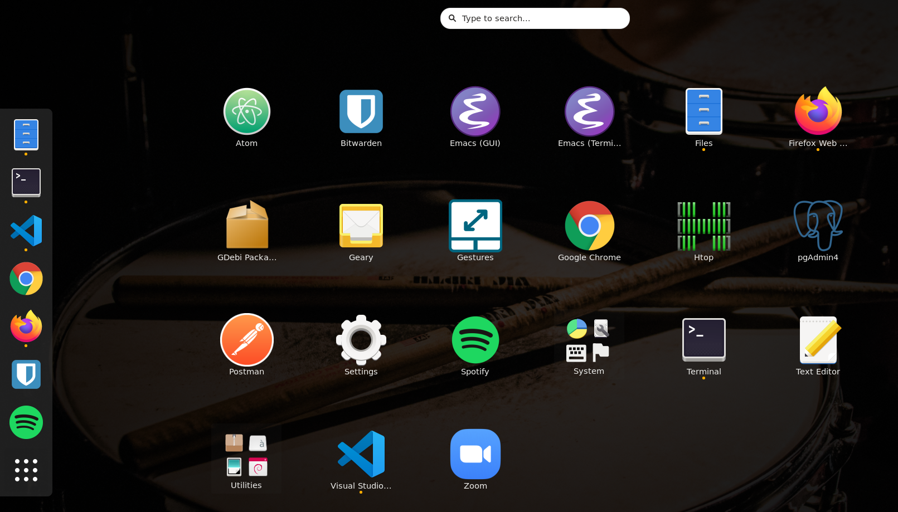
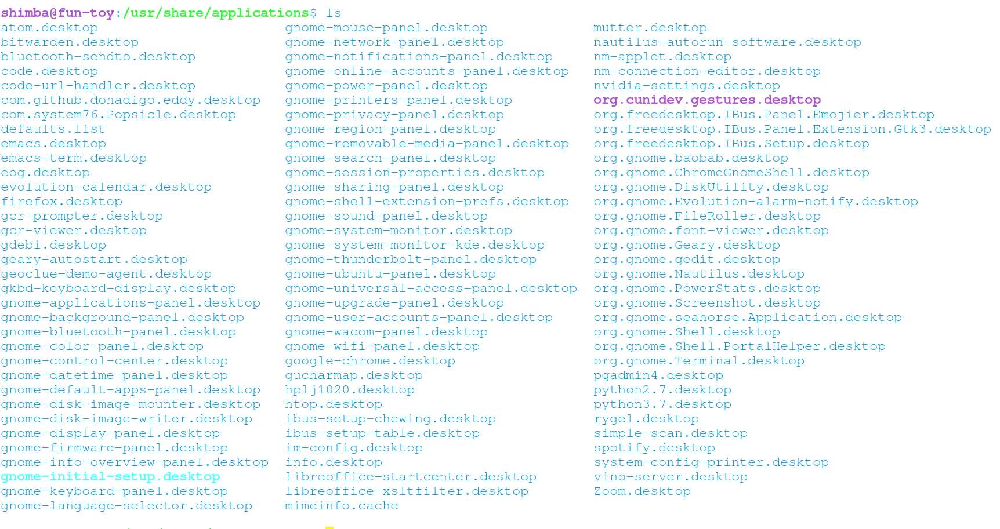

[Smart Brain](https://drcardamom.github.io/smart-brain/)

[Source code for the view](https://github.com/DrCardamom/smart-brain)

[Source code for the server and database](https://github.com/DrCardamom/smart-brain-api)

## What is ```.desktop``` file
After the installation of [Postman](https://www.postman.com/) with Snap, I somehow couldn't open it up although I did see it installed in my /home/Desktop/ (I normally don't like to put anything in /Desktop but the page I referred said so I followed.) I wouldn't have minded starting it up from command line so much but also it would've been nice to have an icon on app launcher.

That's how I got to learn that there is such a thing called ```.desktop``` file, which is basically what lets your computer show you the icon of an application. I didn't see the Postman icon because I didn't have .desktop file pointed at Postman. Yep, makes sense.

Postman official documentation says
> To start the app from a launcher icon, create a desktop file, naming it Postman.desktop and saving it in the following location:
> ``` ~/.local/share/applications/Postman.desktop```

So I added this

```Exec ``` is where the program needs to look for Postman.


and it worked! Postman icon did show up, and when I clicked it, the app did turn up. I was pleased for 2 seconds until another question popped up.



### If ```.desktop``` file is necessary for my machine to show me icons, why am I not seeing files like ```atom.Desktop, Bitwarden.desktop, htop.desktop``` in ```/.local/share/applications``` ? Where are they...?

I found my precious ```.desktop``` babies in ```/usr/share/applications``` after some searching (I avoid saying "googling" because I don't want the equation search = google to be norm. In fact, my default browser & search engine combo is firefox & DuckDuckGo),


This means that ```.desktop``` files can be put in ```/usr/share/applications``` as well! What's the difference? That's another valuable lesson I learned. Globally installed (hence globally accessible) applications go to ```/usr/share/applications``` and locally installed (hence only locally accessible) ones go to ```/.local/share/applications```.

## What is ```$PATH``` & ```.bash``` files
Basically $PATH is a list of directories where your OS look for the program to run when you type commands. I got to learn this because when I installed snap it told me that it wasn't set in the ```$PATH``` and I indeed couldn't run ```snap``` command. Instead of setting ```$PATH``` variables manually, you can set it in ```.bashrc``` file, which gets run every time you open a new terminal, so that it automatically sets it for you. Some Ask!Ubuntu pages say I could set it in ```.bash_profile``` as well but it only works if I set it in ```.bashrc```. The part I have added looks like this


## PostgreSQL
### Relational database and Non-relational database
PostgreSQL is relational database; That is, schema (relationship between each tables) needs to be defined first before you stsrt adding data to them. This also means that each columns need to be set first, whereas non-relational database like MongoDB can accept a new column as you add data.

### User Interface - psql and pgAdmin4
PostgreSQL comes with CLI based controller called psql with which you can interact with databases, but also there is GUI called pgAdmin available.(latest stable version is pgAdmin4) What they can do for you is the same except for the richer interface with pgAdmin, obviously.

### Separation of concern
It is a better practice to have multiple tables that contain less columns than to have less table that contain a massive mount of columns. You can ``` JOIN ``` to relate each tables using a primary key and a foreign key.

### SQL - Structured Query Language

Once you logged into the database, you MUST type ';' at the end of command otherwise it won't work since this is SQL, not shell script nor JavaScript (we are not good at that, are we?)

#### Create Database
```
createdb DATABASE_NAME
```

#### Log into the database 
```
psql 'DATABASE_NAME'
```

#### Create Table
```
CREATE TABLE table_name (column1 datatype, column2 datatype, column3 datatype);
```

#### Constraints: primary key, NOT NULL, UNIQUE
Each table can have only one primary key, which is a combination of NOT NULL constraint and UNIQUE constraint. 
```
CREATE TABLE users (ID serial NOT NULL PRIMARY KEY,
name text UNIQUE NOT NULL,
age smallint,
birthday date NOT NULL);
```

Since Postgre is relational database, you need to define data type for each columns. In addition to [Pre-defined datatypes](https://www.postgresql.org/docs/9.5/datatype.html) available PostgreSQL, you can also set your own datatype using ```CREATE TYPE``` command.

#### List all tables
```
\dt
```

#### Insert a row
```
INSERT INTO table_name (column1, column2, column3th) VALUES (value1, value2, value3);
```
```
INSERT INTO users (name, age, birthday) VALUES ('Shimba', 99, '1921-01-01');
```

#### Show data in a table
```
SELECT datatype, datatype, datatype FROM table_name;
```
For example
```
SELECT name, age, birthday FROM users;
```
if you want all columns to show anyway, you also can use ```*``` (= all)
```
SELECT * FROM table_name;
```

#### Add a column to a pre-existing table
```
ALTER TABLE table_name ADD target_column datatype;
```
```
ALTER TABLE users ADD location text;
```

#### Update data 
```
UPDATE table_name SET target_column=value WHERE target_column=value;
```
```
UPDATE users SET location='Toronto' WHERE name='Shimba';
```
to update data for multiple users
```
UPDATE users SET location='Toronto' WHERE name='Shimba' OR name='Elliot';
```

#### Delete row
```
DELETE table_name WHERE target_column=value_to_be_deleted;
```

#### DROP table
```
DROP TABLE table_name;
```

#### Conditional Selection
```
SELECT * FROM table_name WHERE target_column LIKE condition;
```
```
SELECT * FROM users WHERE name LIKE 'E%';
```
#### Sort a table
Descending order
```
SELECT * FROM table_name ORDER BY target_column DESC;
```
Ascending order
```
SELECT * FROM users ORDER BY age ASC;
```

#### Basic functions
```
SELECT AVG(target_column) FROM table_name;
```
```
SELECT SUM(target_column) FROM table_name;
```
```
SELECT COUNT(target_column) FROM table_name;
```

#### How to ``` JOIN ``` 2 tables
```
SELECT * FROM table1 JOIN table2 ON table1.target_column = table2.target_column
```

***
***
Let me know if you noticed typos or have suggestions/advice. Would be very much appreciated.

GitHub @DrCardamom / [website repo](https://github.com/DrCardamom/shimbaofficial)

Email  <a href="mailto:shimba@posteo.net">shimba@posteo.net</a>